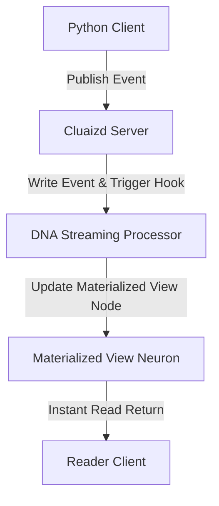

# 🔄 Mode 22: Streaming / Reactive Database Paradigm (RisingWave-Style)

This guide details how to configure and run Cluaizd as a Streaming / Reactive Database, maintaining live materialized views over continuous event streams using dynamic DNA query processors.

---

## 🏛️ Conceptual Mapping & Architecture

In Streaming Mode, queries are pre-compiled and register hooks that listen to incoming data. When a new transaction/event neuron is written to the database, the DNA engine automatically intercepts it, compiles the query results, and updates the Materialized View neurons in real-time, eliminating manual polling.



---

## 🗄️ Server Configuration (`cluaizd.toml`)

Use high-throughput `dashmap` concurrency settings for live parallel streaming ingestion:

```toml
[server]
host = "127.0.0.1"
port = 8080

[database]
concurrency_mode = "dashmap"
payload_format = "json"
```

---

## 🧬 The DNA Script (`genomes/streaming_processor.rhai`)

To calculate and update materialized values (e.g. update aggregate count of incoming logs in real-time):

```rust
// genomes/streaming_processor.rhai
// Live event-stream processor

let payload_str = payload;
let event = json(payload_str);

// Process and update aggregated state (e.g. increments dashboard count)
if event.type == "click" {
    let current_count = config.click_count;
    let new_count = current_count + 1;
    
    return #{
        "update_view": true,
        "new_value": new_count,
        "action": "IncrementView"
    };
}

return #{};
```

---

## 🐍 Client Implementation Examples

### Python Client (Ingesting Stream Events)

```python
import requests
import json

BASE_URL = "http://127.0.0.1:8080"
HEADERS = {
    "x-tenant-id": "streaming_sandbox",
    "Content-Type": "application/json"
}

def publish_stream_event(event_type: str, source: str):
    event_payload = {
        "type": event_type,
        "source": source
    }
    
    payload = {
        "raw_payload": json.dumps(event_payload),
        "vector_data": [0.0] * 16,
        "model_creator_hash": "00" * 32,
        "payload_type": "text",
        "dna": {
            "on_write": "let payload_str = payload; let event = json(payload_str); if event.type == \"click\" { return #{\"action\": \"Allow\"}; } return #{\"action\": \"Allow\"};",
            "parameters": {},
            "engine": "rhai"
        }
    }
    response = requests.post(f"{BASE_URL}/neuron", headers=HEADERS, json=payload)
    return response.json()

# Usage
publish_stream_event("click", "homepage_cta")
```

---

## 📈 Business & Research Applications

- **Live Activity Dashboards:** Updating active visitor counts or sales statistics instantly.
- **High-Frequency Trading Telemetry:** Tracking stock price swings and computing sliding moving averages.
