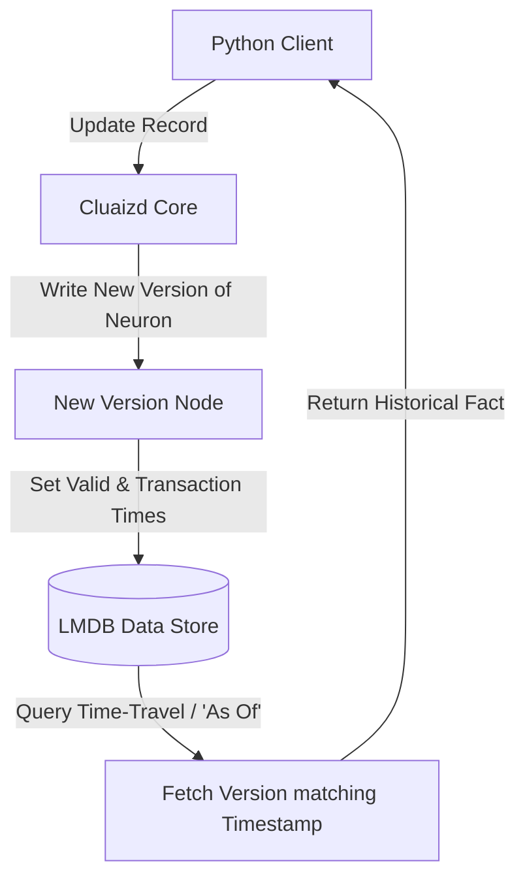

# ⏱️ Mode 23: Temporal / Bi-Temporal Database Paradigm (Datomic-Style)

This guide details how to configure and run Cluaizd as a Temporal / Bi-Temporal Database, managing dual timelines (*Valid Time* vs *Transaction Time*) using co-located timestamps and DNA auditing rules.

---

## 🏛️ Conceptual Mapping & Architecture

In Temporal Mode, records are never overridden or modified directly. When an entity is updated, a new version (neuron) is written. We track two key timelines:
1. **Valid Time:** The real-world timestamp when the fact was true.
2. **Transaction Time:** The database system timestamp when the record was written.
To query past states, DNA scripts retrieve neurons matching specific historical boundaries.



---

## 🗄️ Server Configuration (`cluaizd.toml`)

Set database concurrency setting to `mutex` to serialize timeline transitions:

```toml
[server]
host = "127.0.0.1"
port = 8080

[database]
concurrency_mode = "mutex"
payload_format = "json"
```

---

## 🧬 The DNA Script (`genomes/temporal_timeline.rhai`)

To enforce timeline ordering and audit validation during write operations:

```rust
// genomes/temporal_timeline.rhai
// Temporal database write validator

let payload_str = payload;
let version = json(payload_str);

// Ensure valid_time is set
if version.valid_time_ns <= 0 {
    return #{
        "action": "Abort",
        "error": "Temporal records must declare a valid_time_ns timestamp."
    };
}

return #{
    "action": "Allow"
};
```

---

## 🐍 Client Implementation Examples

### Python Client (Adding Versions and Executing "As Of" Queries)

```python
import requests
import json
import time

BASE_URL = "http://127.0.0.1:8080"
HEADERS = {
    "x-tenant-id": "temporal_sandbox",
    "Content-Type": "application/json"
}

def insert_temporal_version(entity_id: str, value: str, valid_time_ns: int):
    version_payload = {
        "entity_id": entity_id,
        "value": value,
        "valid_time_ns": valid_time_ns,
        "transaction_time_ns": int(time.time() * 1000000000)
    }
    
    payload = {
        "raw_payload": json.dumps(version_payload),
        "vector_data": [0.0] * 16,
        "model_creator_hash": "00" * 32,
        "payload_type": "text"
    }
    response = requests.post(f"{BASE_URL}/neuron", headers=HEADERS, json=payload)
    return response.json()

# Usage
# Store dynamic historical edits without losing original records
insert_temporal_version("user_100", "State A", 1700000000000000000)
insert_temporal_version("user_100", "State B", 1710000000000000000)
```

---

## 📈 Business & Research Applications

- **Double-Entry Financial Auditing:** Reviewing ledger balances "as of" specific historical quarters.
- **Legal Record Repositories:** Tracking document modifications and revisions over time for compliance reporting.
