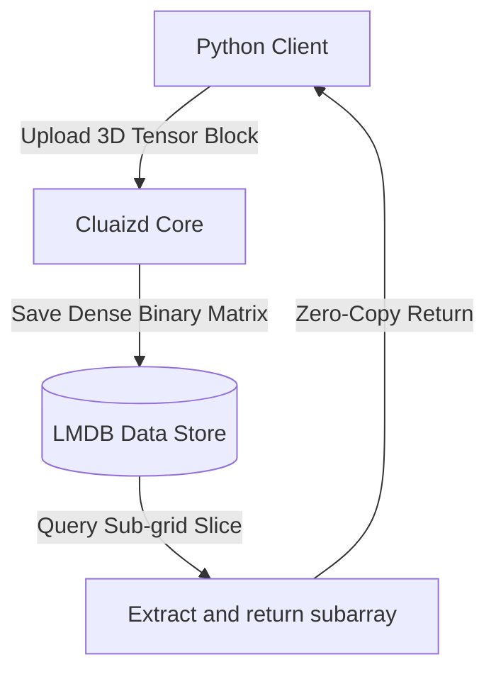

# 🧮 Mode 24: Array / Tensor / Multidimensional Database Paradigm (SciDB-Style)

This guide details how to configure and run Cluaizd as a Multidimensional Array / Tensor Database, optimized for dense scientific grids, matrix calculations, and ML model weight allocations.

---

## 🏛️ Conceptual Mapping & Architecture

In Array Mode, instead of flat tables or simple vectors, we store $N\text{-Dimensional}$ dense grids or tensors. The data is packed into zero-copy binary arrays inside the neuron's `raw_payload`. DNA index and traversal hooks run calculations (like matrix transpose, dot product, or slice operations) using native SIMD acceleration.



---

## 🗄️ Server Configuration (`cluaizd.toml`)

Set default serialization format to `flatbuffers` or `json` to permit high-speed binary array transfers:

```toml
[server]
host = "127.0.0.1"
port = 8080

[database]
concurrency_mode = "dashmap"
payload_format = "json"
```

---

## 🧬 The DNA Script (`genomes/tensor_bounds.rhai`)

To enforce dimension bounds validation (e.g. check that the tensor block size matches expected coordinate dimensions):

```rust
// genomes/tensor_bounds.rhai
// Tensor bounds write validator

let payload_str = payload;
let tensor = json(payload_str);

// Ensure dimensions are valid (e.g. 16x16 grid = 256 values)
if tensor.dimensions.len() != 3 {
    return #{
        "action": "Abort",
        "error": "Tensor must specify 3D dimensions [X, Y, Z]."
    };
}

return #{
    "action": "Allow"
};
```

---

## 🐍 Client Implementation Examples

### Python Client (Uploading and Querying 3D Arrays)

```python
import requests
import json

BASE_URL = "http://127.0.0.1:8080"
HEADERS = {
    "x-tenant-id": "tensor_sandbox",
    "Content-Type": "application/json"
}

def upload_tensor_block(tensor_id: str, dimensions: list, data_flat: list):
    # Store a dense float array with dimension metadata
    tensor_payload = {
        "tensor_id": tensor_id,
        "dimensions": dimensions,
        "data": data_flat
    }
    
    payload = {
        "raw_payload": json.dumps(tensor_payload),
        "vector_data": [0.0] * 16,
        "model_creator_hash": "00" * 32,
        "payload_type": "binary"
    }
    response = requests.post(f"{BASE_URL}/neuron", headers=HEADERS, json=payload)
    return response.json()

# Usage
# Uploading a 2x2x2 dense float tensor
upload_tensor_block("weight_matrix_1", [2, 2, 2], [0.1, 0.2, 0.3, 0.4, 0.5, 0.6, 0.7, 0.8])
```

---

## 📈 Business & Research Applications

- **AI Model Weights Storage:** Storing and retrieving network model weights without serialization tax.
- **Satellite Weather Grids:** Mapping atmospheric metrics across global 3D geographic coordinates.
- **Geophysical Scanning:** Retaining oil/gas seismic density profiles.
