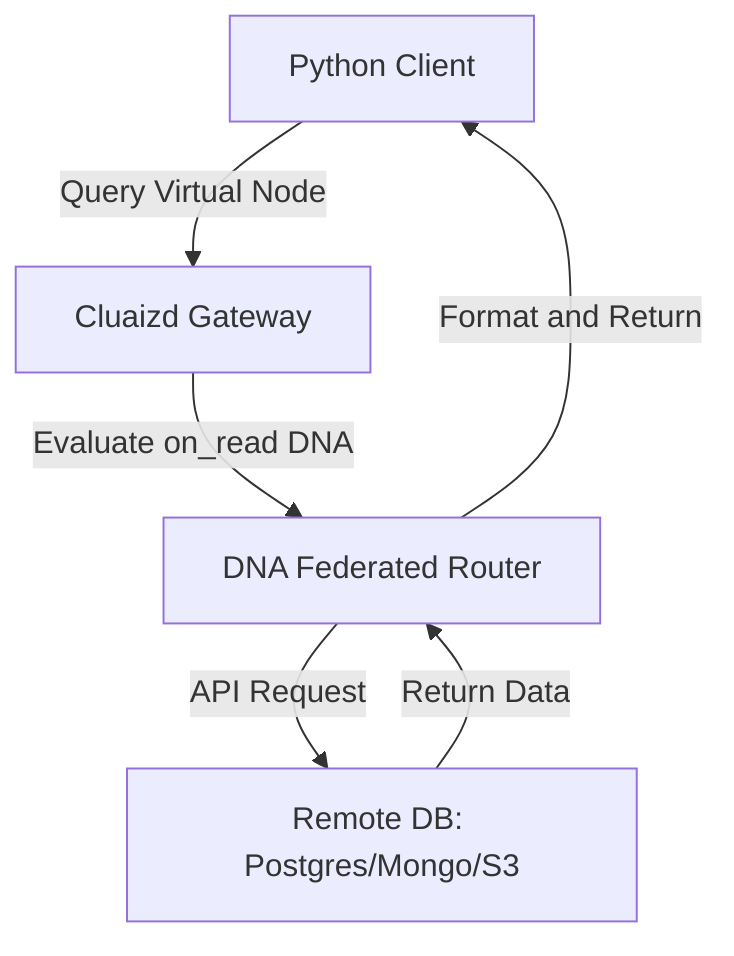

# 🌉 Mode 25: Federated / Virtual Database Paradigm (Presto-Style)

This guide details how to configure and run Cluaizd as a Federated / Virtual Database, resolving queries across external systems using routing links.

---

## 🏛️ Conceptual Mapping & Architecture

In Federated Mode, Cluaizd act as a virtual data gateway. Instead of holding raw records locally, neurons store connections, APIs, and credentials pointing to external databases (e.g. Postgres, MongoDB, S3). When a query is run, the DNA `on_read` hook resolves the request, fetches the remote data, and returns it dynamically.



---

## 🗄️ Server Configuration (`cluaizd.toml`)

Set concurrency settings to `dashmap` to optimize parallel remote API gateway calls:

```toml
[server]
host = "127.0.0.1"
port = 8080

[database]
concurrency_mode = "dashmap"
payload_format = "json"
```

---

## 🧬 The DNA Script (`genomes/federated_router.rhai`)

To route queries dynamically and fetch records from external APIs on read:

```rust
// genomes/federated_router.rhai
// Federated virtual database router

let config = config;
let target_url = config.remote_api_endpoint;

// The actual fetching logic is handled in the client application 
// or by custom WASM extensions calling network bindings.
return #{
    "route_query": true,
    "endpoint": target_url
};
```

---

## 🐍 Client Implementation Examples

### Python Client (Creating Virtual Gateway Nodes)

```python
import requests
import json

BASE_URL = "http://127.0.0.1:8080"
HEADERS = {
    "x-tenant-id": "federated_sandbox",
    "Content-Type": "application/json"
}

def create_virtual_link(node_name: str, target_api: str):
    gateway_payload = {
        "virtual_node": node_name,
        "remote_api_endpoint": target_api
    }
    
    payload = {
        "raw_payload": json.dumps(gateway_payload),
        "vector_data": [0.0] * 16,
        "model_creator_hash": "00" * 32,
        "payload_type": "text",
        "dna": {
            "on_read": "let config = json(payload); return #{\"endpoint\": config.remote_api_endpoint};",
            "parameters": {},
            "engine": "rhai"
        }
    }
    response = requests.post(f"{BASE_URL}/neuron", headers=HEADERS, json=payload)
    return response.json()

# Usage
create_virtual_link("billing_postgres_replica", "https://api.internal/postgres/billing")
```

---

## 📈 Business & Research Applications

- **Polystore Enterprise Querying:** Intersecting scattered database layers (SQL + NoSQL) via a single unified API gateway.
- **Legacy Migration Systems:** Routing queries from new applications down to old SQL tables.
