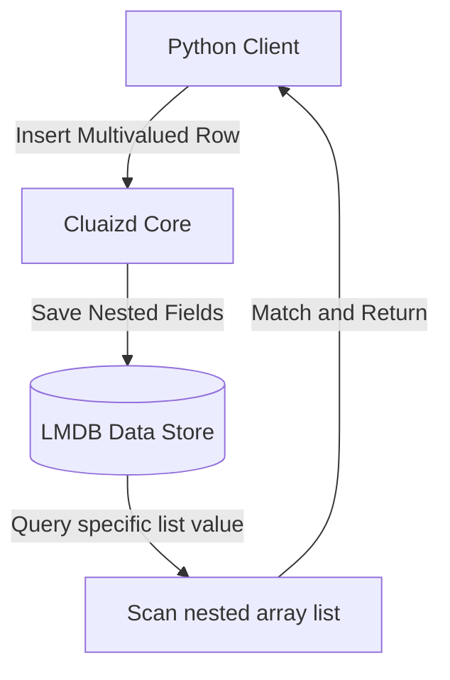

# 🌌 Mode 26: Multivalued Database Paradigm (Pick Model / non-1NF Style)

This guide details how to configure and run Cluaizd as a Multivalued Database, violating SQL's First Normal Form by storing list arrays directly inside single table cells.

---

## 🏛️ Conceptual Mapping & Architecture

In Multivalued Mode, we bypass the relational restriction of storing only atomic values in columns. Using JSON nested lists inside `raw_payload`, a single neuron attribute holds multiple values (e.g. `phone_numbers: ["555-0100", "555-0200"]`) without requiring foreign key relationships or separate phone tables.



---

## 🗄️ Server Configuration (`cluaizd.toml`)

Enable lock-free writing via `dashmap` to optimize parallel JSON list parsing:

```toml
[server]
host = "127.0.0.1"
port = 8080

[database]
concurrency_mode = "dashmap"
payload_format = "json"
```

---

## 🧬 The DNA Script (`genomes/multivalued_validator.rhai`)

To validate multivalued lists dynamically (e.g. ensure array attributes have correct type structures):

```rust
// genomes/multivalued_validator.rhai
// Multivalued list structure validator

let payload_str = payload;
let row = json(payload_str);

// Ensure multivalued field is a list
if type_of(row.phone_numbers) != "array" {
    return #{
        "action": "Abort",
        "error": "Field 'phone_numbers' must be a Multivalued Array List."
    };
}

return #{
    "action": "Allow"
};
```

---

## 🐍 Client Implementation Examples

### Python Client (Inserting and Filtering Multivalued Fields)

```python
import requests
import json

BASE_URL = "http://127.0.0.1:8080"
HEADERS = {
    "x-tenant-id": "multivalued_sandbox",
    "Content-Type": "application/json"
}

def insert_multivalued_row(name: str, phones: list):
    row_payload = {
        "name": name,
        "phone_numbers": phones
    }
    
    payload = {
        "raw_payload": json.dumps(row_payload),
        "vector_data": [0.0] * 16,
        "model_creator_hash": "00" * 32,
        "payload_type": "text"
    }
    response = requests.post(f"{BASE_URL}/neuron", headers=HEADERS, json=payload)
    return response.json()

# Usage
insert_multivalued_row("Aryan", ["123-456", "789-012"])
```

---

## 📈 Business & Research Applications

- **Contact Directories:** Storing multiple email addresses or phone contacts under single user rows.
- **Sparse Inventory Systems:** Storing variable tags or accessory lists under product records.
