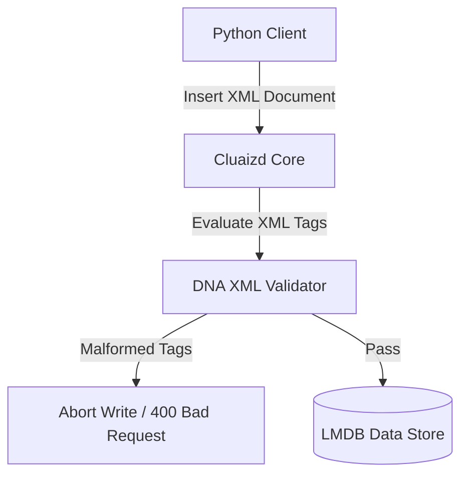

# 🌌 Mode 27: Native XML Database Paradigm (MarkLogic-Style)

This guide details how to configure and run Cluaizd as a Native XML Database, validating structured XML payloads and tag structures within DNA write hooks.

---

## 🏛️ Conceptual Mapping & Architecture

In Native XML Mode, records are stored as XML strings inside `raw_payload`. Instead of JSON structures, validation and filtering utilize hierarchical XML tags (such as XPath/XQuery specifications). DNA write hooks scan for nested XML elements and reject malformed schemas.



---

## 🗄️ Server Configuration (`cluaizd.toml`)

Set database concurrency mode to `dashmap` to optimize concurrent read query validation:

```toml
[server]
host = "127.0.0.1"
port = 8080

[database]
concurrency_mode = "dashmap"
payload_format = "json"
```

---

## 🧬 The DNA Script (`genomes/xml_validator.rhai`)

To validate basic XML tags dynamically on write (e.g. ensure tag wrappers match):

```rust
// genomes/xml_validator.rhai
// XML layout write validator

let payload_str = payload;

// Simple validation: check for XML tags
if !payload_str.contains("<") || !payload_str.contains(">") {
    return #{
        "action": "Abort",
        "error": "Payload is not a valid XML document format."
    };
}

return #{
    "action": "Allow"
};
```

---

## 🐍 Client Implementation Examples

### Python Client (Adding and Searching XML Records)

```python
import requests
import xml.etree.ElementTree as ET

BASE_URL = "http://127.0.0.1:8080"
HEADERS = {
    "x-tenant-id": "xml_sandbox",
    "Content-Type": "application/json"
}

def insert_xml_document(xml_string: str):
    # Verify XML parses before posting
    ET.fromstring(xml_string)
    
    payload = {
        "raw_payload": xml_string,
        "vector_data": [0.0] * 16,
        "model_creator_hash": "00" * 32,
        "payload_type": "text",
        "dna": {
            "on_write": "let payload_str = payload; if !payload_str.contains(\"<\") { return #{\"action\": \"Abort\", \"error\": \"No tags\"}; } return #{\"action\": \"Allow\"};",
            "parameters": {},
            "engine": "rhai"
        }
    }
    response = requests.post(f"{BASE_URL}/neuron", headers=HEADERS, json=payload)
    return response.json()

# Usage
insert_xml_document("<user><name>Aryan</name><age>25</age></user>")
```

---

## 📈 Business & Research Applications

- **Legacy Legal & Government Repositories:** Storing legislative records archived in XML schemas.
- **Publishing Systems:** Managing complex document structures and layouts.
