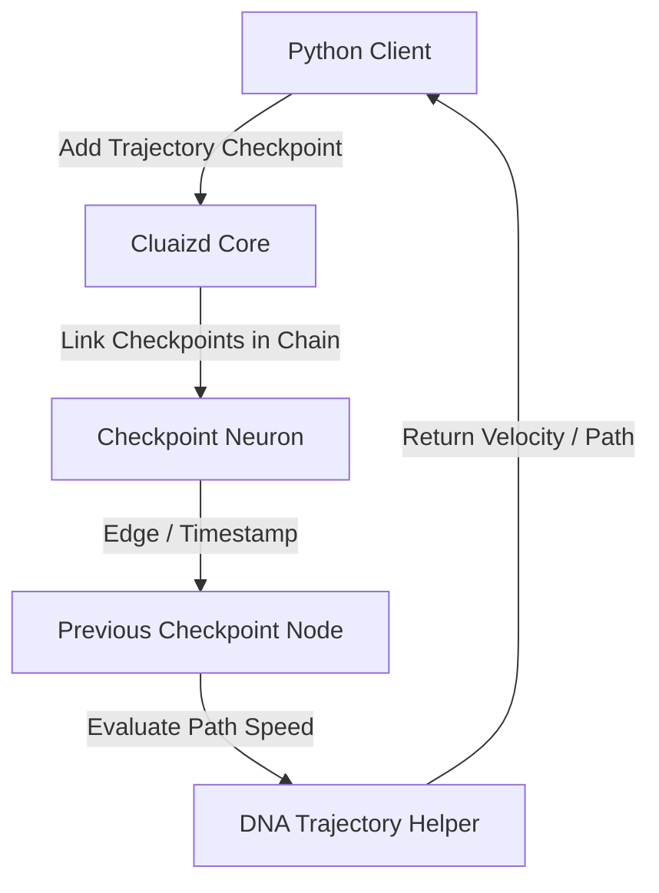

# 🌍 Mode 28: Spatial-Temporal / Moving Object Database Paradigm (MobilityDB-Style)

This guide details how to configure and run Cluaizd as a Spatial-Temporal / Moving Object Database, tracking dynamic trajectories, velocities, and changing coordinate paths over time.

---

## 🏛️ Conceptual Mapping & Architecture

In Moving Object Mode, we track objects whose coordinates change continuously (such as flying drones or autonomous driving vehicles). The coordinate timeline is stored as a series of timestamped spatial coordinates inside the neuron's payload, or linked as a chronological graph chain of trajectory checkpoints using adjacencies.



---

## 🗄️ Server Configuration (`cluaizd.toml`)

Configure parallel write scaling via `dashmap` to support rapid location stream tracking:

```toml
[server]
host = "127.0.0.1"
port = 8080

[database]
concurrency_mode = "dashmap"
payload_format = "json"
```

---

## 🧬 The DNA Script (`genomes/trajectory_velocity.rhai`)

To calculate object velocity between two logged checkpoints (e.g. coordinates and timestamp shifts):

```rust
// genomes/trajectory_velocity.rhai
// Calculate moving object trajectory velocity

let payload_str = payload;
let checkpoint = json(payload_str);

// Validate checkpoint coordinates
if checkpoint.lat == 0.0 || checkpoint.lon == 0.0 {
    return #{
        "action": "Abort",
        "error": "Checkpoint must register valid latitude and longitude coordinates."
    };
}

return #{
    "action": "Allow"
};
```

---

## 🐍 Client Implementation Examples

### Python Client (Logging Trajectory Checkpoints)

```python
import requests
import json
import time

BASE_URL = "http://127.0.0.1:8080"
HEADERS = {
    "x-tenant-id": "mobility_sandbox",
    "Content-Type": "application/json"
}

def log_drone_checkpoint(drone_id: str, lat: float, lon: float, alt: float, prev_checkpoint_id: str = None):
    checkpoint_payload = {
        "drone_id": drone_id,
        "lat": lat,
        "lon": lon,
        "altitude": alt,
        "timestamp": int(time.time() * 1000)
    }
    
    adjacency = []
    if prev_checkpoint_id:
        # Link current position back to previous position to map the flight path
        adjacency.append({
            "target_id": prev_checkpoint_id,
            "weight": 1.0
        })
        
    payload = {
        "raw_payload": json.dumps(checkpoint_payload),
        "vector_data": [lat, lon, alt] + [0.0] * 13,
        "model_creator_hash": "00" * 32,
        "payload_type": "text",
        "adjacency": adjacency
    }
    response = requests.post(f"{BASE_URL}/neuron", headers=HEADERS, json=payload)
    return response.json()

# Usage
cp1 = log_drone_checkpoint("drone_100", 40.7850, -73.9682, 100.0)
cp2 = log_drone_checkpoint("drone_100", 40.7855, -73.9680, 105.0, prev_checkpoint_id=cp1["neuron_id"])
```

---

## 📈 Business & Research Applications

- **Drone Flight Analytics:** Reconstruction and analysis of drone coordinates and flight trajectories.
- **Autonomous Vehicle Tracking:** Telemetry analysis of self-driving fleets.
