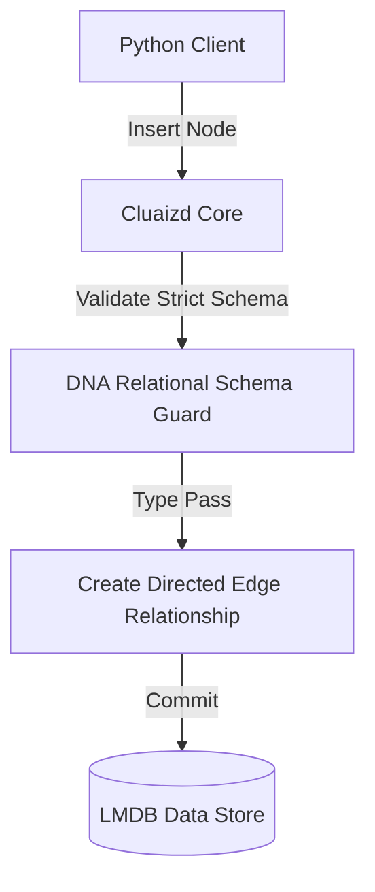

# 🕸️ Mode 29: Graph-Relational Hybrid Engine Paradigm (EdgeDB-Style)

This guide details how to configure and run Cluaizd as a Graph-Relational Hybrid Engine, combining strict relational schema validation with dynamic graph connections.

---

## 🏛️ Conceptual Mapping & Architecture

In Graph-Relational Mode, we eliminate the mismatch between tabular rows and graph vertices. Neurons (objects) declare strict schemas (relations) validated via DNA `on_write` scripts. Links between these objects are mapped as directed graph adjacencies. This enforces strict enterprise data schemas while permitting fast recursive traversals without joins.



---

## 🗄️ Server Configuration (`cluaizd.toml`)

Use the strict `mutex` concurrency model to enforce transaction serializability across relational objects:

```toml
[server]
host = "127.0.0.1"
port = 8080

[database]
concurrency_mode = "mutex"
payload_format = "json"
```

---

## 🧬 The DNA Script (`genomes/graph_relational.rhai`)

To enforce strict relational typing on graph nodes during writes:

```rust
// genomes/graph_relational.rhai
// Graph-Relational object validator

let payload_str = payload;
let obj = json(payload_str);

// Validate strict properties
if type_of(obj.title) != "string" || type_of(obj.release_year) != "int" {
    return #{
        "action": "Abort",
        "error": "Object 'Movie' property type mismatch."
    };
}

return #{
    "action": "Allow"
};
```

---

## 🐍 Client Implementation Examples

### Python Client (Creating Graph-Relational Objects)

```python
import requests
import json

BASE_URL = "http://127.0.0.1:8080"
HEADERS = {
    "x-tenant-id": "graphrelational_sandbox",
    "Content-Type": "application/json"
}

def create_movie_node(title: str, year: int, actors: list):
    movie_payload = {
        "title": title,
        "release_year": year
    }
    
    # Establish graph links (edges) to actor nodes
    adjacency = [{"target_id": aid, "weight": 1.0} for aid in actors]
    
    payload = {
        "raw_payload": json.dumps(movie_payload),
        "vector_data": [0.0] * 16,
        "model_creator_hash": "00" * 32,
        "payload_type": "text",
        "adjacency": adjacency,
        "dna": {
            "on_write": "let payload_str = payload; let obj = json(payload_str); if type_of(obj.title) != \"string\" { return #{\"action\": \"Abort\"}; } return #{\"action\": \"Allow\"};",
            "parameters": {},
            "engine": "rhai"
        }
    }
    response = requests.post(f"{BASE_URL}/neuron", headers=HEADERS, json=payload)
    return response.json()

# Usage
# Create Movie object connected directly to Actor objects
```

---

## 📈 Business & Research Applications

- **Enterprise Knowledge Bases:** Connecting companies, divisions, and employees with strict type constraints.
- **Academic Citation Networks:** Modeling university structures, research categories, and citations.
