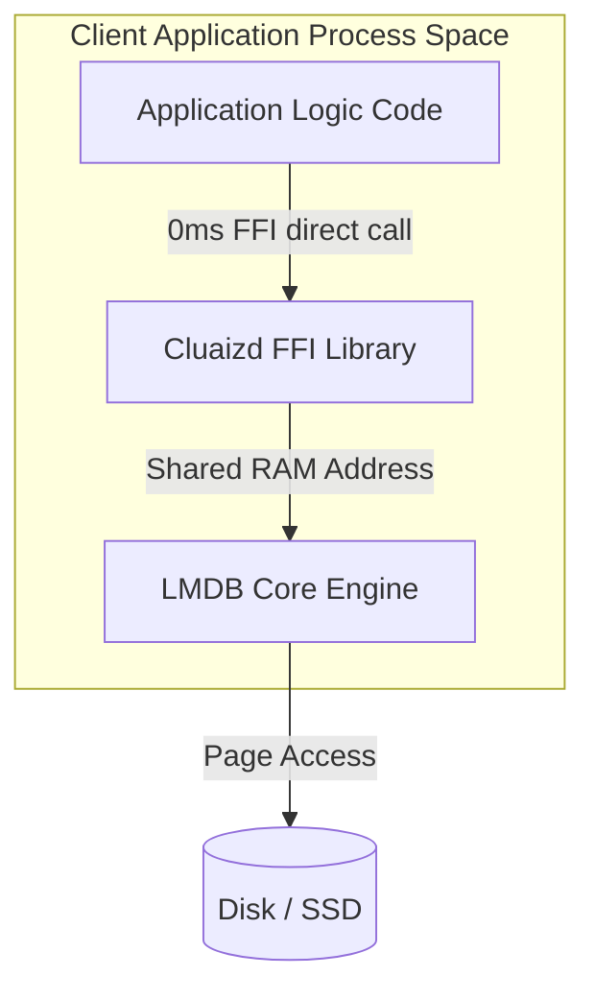

# 📦 Mode 30: Embedded / In-Process Database Paradigm (LMDB / SQLite-Style)

This guide details how to configure and run Cluaizd as an Embedded / In-Process Database, enabling zero-network latency, direct application space sharing, and C-FFI bindings.

---

## 🏛️ Conceptual Mapping & Architecture

In Embedded Mode, Cluaizd operates without running an external server process. The core database library is linked directly inside the client application (e.g. C/C++, Rust, or Python via FFI). The database maps its database files directly into the calling application's virtual RAM address space (`mmap`), reducing FFI/network latency to absolute zero.



---

## 🗄️ Server Configuration (`cluaizd.toml`)

Since there is no external server, no network configuration is required. The database environment is opened directly via path declaration in the application code.

---

## 🧬 C-FFI API Reference (`cluaizd.h`)

Below are the native FFI C declarations exposed by the `cluaizd-ffi` library to bind the database directly inside C/C++ or Python:

```c
// Open the database environment at a given path
CluaizdHandle* cluaizd_open(const char* path, size_t map_size_mb);

// Write a byte payload directly to the LMDB memory mapping
char* cluaizd_write(CluaizdHandle* handle, const uint8_t* payload, size_t payload_len, const char* payload_type);

// Read a payload by its UUID string
uint8_t* cluaizd_read(CluaizdHandle* handle, const char* neuron_id, unsigned long* out_len);

// Close and free the environment resources
void cluaizd_close(CluaizdHandle* handle);
```

---

## 🐍 Client Implementation Examples

### Python Client (Direct C-FFI Call via ctypes)

```python
import ctypes
import os

# Load the compiled cluaizd-ffi library
lib_path = "./target/release/cluaizd.dll" if os.name == "nt" else "./target/release/libcluaizd.so"
cluaizd = ctypes.CDLL(lib_path)

# Configure argument and return types
cluaizd.cluaizd_open.argtypes = [ctypes.c_char_p, ctypes.c_size_t]
cluaizd.cluaizd_open.restype = ctypes.c_void_p

cluaizd.cluaizd_write.argtypes = [ctypes.c_void_p, ctypes.c_char_p, ctypes.c_size_t, ctypes.c_char_p]
cluaizd.cluaizd_write.restype = ctypes.c_char_p

cluaizd.cluaizd_close.argtypes = [ctypes.c_void_p]

# Open local database mapping (0ms Network Latency!)
db_handle = cluaizd.cluaizd_open(b"./data/local_embedded_db", 1024)

# Write direct payload
payload = b"sensor_voltage_check"
neuron_id = cluaizd.cluaizd_write(db_handle, payload, len(payload), b"text")
print("Saved Local Neuron UUID:", neuron_id.decode("utf-8"))

# Close environment
cluaizd.cluaizd_close(db_handle)
```

---

## 📈 Business & Research Applications

- **Robotic Control Units:** Direct in-process logging of LiDAR sensor data to prevent network driver overhead.
- **Mobile Edge Memory caches:** Running private semantic search layers directly on local smartphones or tablets.
- **Embedded BCI Signal Processing:** High-throughput logging of brain electrophysiological activity within native C-SDK handlers.
