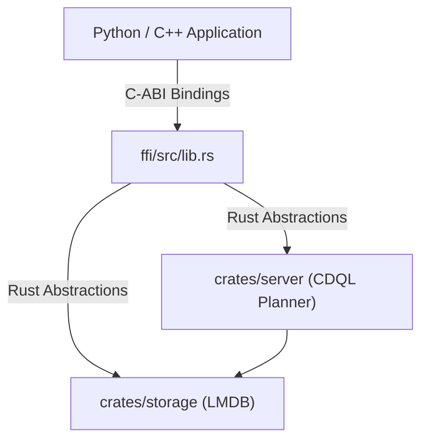

# 🌉 FFI: Foreign Function Interface

## Purpose
The `ffi/` directory exposes the Cluaizd core database engine as a C-compatible shared library (`.dll`, `.so`, or `.dylib`). This allows other languages like Python, C++, Go, or Node.js to embed and call the database natively in-process without the overhead of HTTP networks.

## Architecture Flow

## 🧬 Significant Files (Deep Code-Level Breakdown)

### `src/lib.rs`
This is the core entry point for the Foreign Function Interface. It uses Rust's `extern "C"` ABI to expose the `cluaizd` engine to other languages (like Python, C++, or Go) with zero HTTP/WebSocket overhead.

**1. Database Initialization (`cluaizd_open`)**
- **Core Logic:** Maps a C-string path into a Rust `Path` and initializes the `LmdbEnv` (Lightning Memory-Mapped Database Environment). 
- **Execution Flow:** It calculates `map_size_mb * 1024 * 1024` to pre-allocate LMDB virtual memory mapping. It encapsulates the `LmdbEnv` inside a `CluaizdHandle` struct, wraps it in a `Box`, and uses `Box::into_raw(handle)` to yield an opaque pointer (`*mut CluaizdHandle`) back to the C caller.
- **Why?** Passing raw pointers is the only way to persist state across the C ABI. The C caller owns this pointer until it explicitly calls `cluaizd_close`.

**2. Data Ingestion (`cluaizd_write`)**
- **Core Logic:** Receives raw byte pointers (`*const u8`), payload length, and a payload type string.
- **Execution Flow:** It uses `unsafe { std::slice::from_raw_parts }` to convert the raw C pointer into a Rust slice, then copies it into a `Bytes` struct. It constructs a `UniversalNeuron`. Crucially, it attempts to parse the payload as JSON to hydrate a custom `NeuronDna`. Finally, it invokes `GenomeExecutor::execute_on_write` (the WASM subconscious AI evaluation) before persisting to LMDB via `engine_lmdb::write_neuron`.
- **Why?** It ensures that even FFI (C-level) inserts respect the database's DNA rules and paradigms, preventing malicious or malformed data from bypassing the engine's safeguards.

**3. Query Execution (`cluaizd_query`)**
- **Core Logic:** Accepts a raw C-string representing a CDQL query (e.g., `find *(name: "Aryan")`).
- **Execution Flow:** It uses `CStr::from_ptr` to parse the query string, then passes it to `genome::cdql::parser::parse`. It constructs an AST, builds an execution plan (`build_plan`), and iterates over all LMDB neurons, applying `FastPathIdLookup` or `ScanAll` filters based on the CDQL steps. It returns a heap-allocated JSON string array of UUIDs.
- **Why?** This demonstrates that the FFI boundary contains the full power of the CDQL pipeline, allowing C/C++ applications to query the database as if they were natively written in Rust.

**4. Memory Safety (`cluaizd_free_string`, `cluaizd_free_bytes`)**
- **Core Logic:** Manual destructor functions for C callers.
- **Execution Flow:** Uses `CString::from_raw(ptr)` and `drop(Box::from_raw(slice))` to reclaim memory allocated by Rust.
- **Why?** Memory allocated by Rust's allocator MUST be freed by Rust's allocator. If a C application uses `free()` on a pointer returned by `cluaizd_query`, it will cause a segmentation fault. These functions guarantee memory safety across the language boundary.
