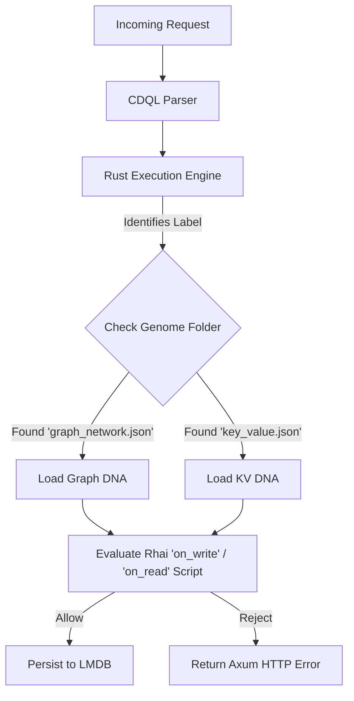

# 🧬 Genomes: The Core Database DNA

## Purpose
The `genomes/` directory contains the foundational JSON templates that define the behavior, validation rules, and lifecycle logic for the **30 distinct Database Paradigms** supported by Cluaizd. Rather than hardcoding database logic in Rust, Cluaizd uses these "Smart Contracts for Data" to determine how the storage engine handles reads, writes, and indexing for different data models (e.g., Relational, Graph, Vector, Document).

## Architecture Flow

## 🧬 Significant Files (Deep Code-Level Breakdown)

### Base JSON Files (e.g., `key_value.json`, `graph_network.json`, `spatial_temporal.json`)
These files define the precise behaviors, validation logic, and indices for all 30 unique database paradigms.

**1. The `on_write` and `on_read` Rhai Hooks**
- **Core Logic:** Each file contains raw Rhai scripting language strings (e.g., `let res = #{ action: "Allow" }; if payload.size > 1024 { res.action = "Reject" }`). 
- **Execution Flow:** When a `UniversalNeuron` is inserted via HTTP or FFI, the `cluaizd-genome` crate fetches the appropriate JSON based on the payload's type or explicitly defined DNA hook. The Rhai script evaluates the byte array. If the script returns `"Reject"`, the entire database transaction is aborted.
- **Why?** This is "Smart Contracts for Data." It prevents the Rust core from becoming bloated with `if/else` statements for 30 different database paradigms. 

**2. Compilation to WASM (`cluaizd-dna-templates`)**
- **Core Logic:** While the files here are plain text JSON/Rhai, they do not execute in this raw format in production.
- **Execution Flow:** The Rust compiler (or an external agent build step) parses these JSON files and embeds them into heavily optimized WebAssembly (`.wasm`) binaries.
- **Why?** Evaluating interpreted Rhai scripts on every database read/write would destroy the million-ops/sec performance of LMDB. By pre-compiling these rules into native-speed WASM sandbox boundaries, Cluaizd ensures absolute memory safety (a bad script cannot crash Rust) and extreme performance.

**3. Specific Paradigm Enforcement**
- **`event_sourcing.json`:** Explicitly checks if a write is an update. If `payload.is_update == true`, the write is aborted, enforcing the strict "Append-Only" requirement of Event Sourcing without needing custom Rust code.
- **`embedded.json`:** Enforces strict memory footprints by rejecting payloads over 1KB, ensuring the database can run on minimal IoT hardware.
- **`sql_strict.json`:** Forces validation of schemas and explicit transaction ID tracking.
